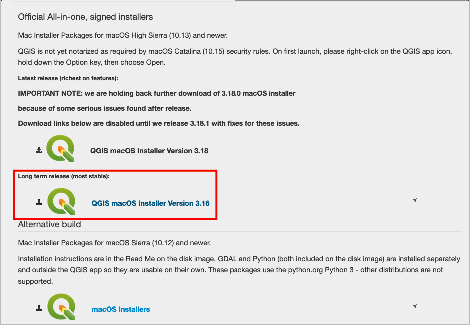
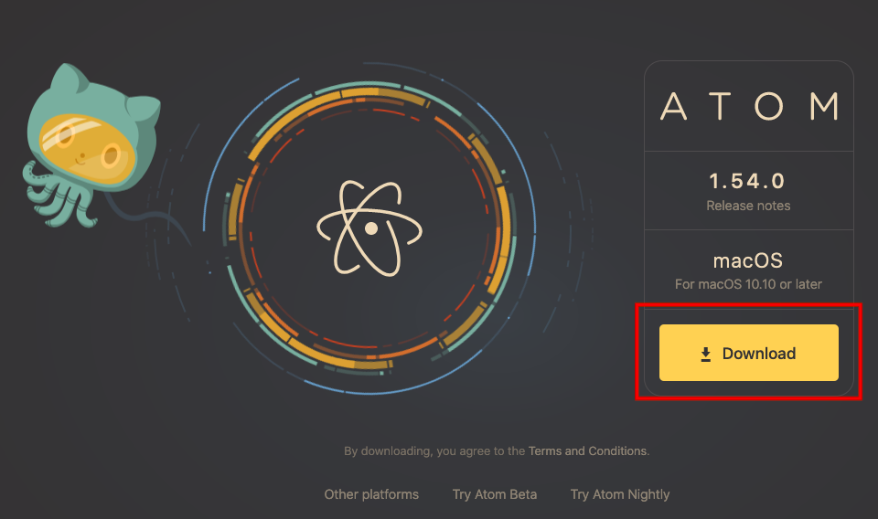
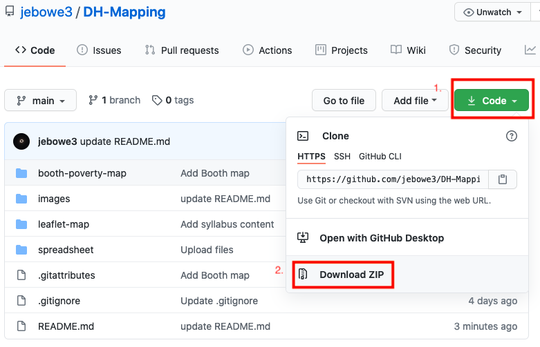
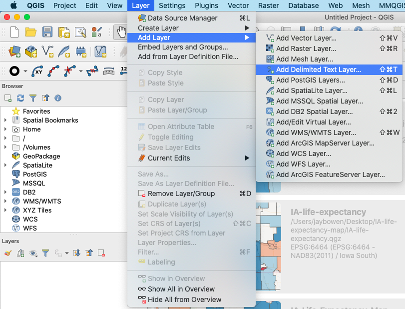

# Digital Humanities Theory and Practice
Weeks 8 and 9: Digital Cartography Theory and Practice

## Contents

- [Week 8: Basic Tech and Techniques for Digital Cartography](#week-8-basic-tech-and-techniques-for-digital-cartography)
  - [Download QGIS Desktop Software](#download-qgis-desktop-software)
  - [Download Atom Text Editor](#download-atom-text-editor)
  - [Step 1: Download This Repository and Upload the Sherlock CSV to QGIS](#step-1-download-this-repository-and-upload-the-sherlock-csv-to-qgis)

## Week 8: Basic Tech and Techniques for Digital Cartography
Note: Before class, please download QGIS and Atom, as discussed below.

In this class, we will walk through some of the basics of doing GIS in the digital humanities. For this, we will focus on open source approaches, making use of free desktop GIS software ([QGIS](https://www.qgis.org/en/site/)), a versatile text editor ([Atom](https://atom.io/)), and a nimble JavaScript library for web mapping called [Leaflet](https://leafletjs.com/). Using QGIS, we will see how to map a [spreadsheet](spreadsheet/SHERLOCK_HOLMES_LONDON.csv) containing points of interest from the Sherlock Holmes series of detective stories. In this case, I downloaded these points from a pre-existing project ([The London of Sherlock Holmes](https://www.google.com/maps/d/viewer?ll=51.510345653313024%2C-0.12769532132744787&z=14&mid=11hi6OwDoifyUI4kFsg7suBQm1t8)) and have cleaned and prepared this dataset for our purposes, but it is good to keep in mind that data preparation and cleanup are fundamental steps in most GIS work.

With QGIS, you will learn how to upload a csv file with latitude and longitude data to visualize points on a map. Then, you will bring in [a scanned and georeferenced historic base map](https://davidrumsey.georeferencer.com/maps/b0af04e4-993d-52da-b642-1051e9877e7f/) for more temporal authenticity. Also, you will learn how to label the mapped points and create a static map. Then, we will discuss the limitations of such a map for these data and consider how interactive web mapping might help improve things.

Using QGIS, we will export our csv data as a JavaScript-friendly GeoJSON file (later, we will look briefly at how to parse csv data directly). Using the local path to this new GeoJSON file, we will generate an interactive web map. Don't worry! I have written the code for you. However, we will take a quick look at what the code is doing behind the scenes.

Finally, it is important to emphasize that our objective is not to develop an extensive understanding of GIS and web mapping techniques, but to learn what sorts of possibilities are available to you. Please let me know at any time if you would like to learn more.

### Download QGIS Desktop Software
You can download the appropriate version of QGIS for your platform [here](https://qgis.org/en/site/forusers/download.html). When doing so, please choose the option under the heading that states "long term release" as shown in the image below.

  
**Figure 01**. Download the long term release of QGIS.

As their site explains, QGIS is "a free and open source geographic information system," which allows you to "create, edit, visualize, analyze, and publish geospatial information." If you have done any mapping in the past, you may have worked with ArcGIS. Both allow you to do many of the same things in very similar ways. However, given our ongoing off-campus needs, I find that free software that you can run on a Mac is a nice option when you cannot make use of on-campus resources. The more that you use both, you will find that there is a lot of crossover, and the sills you learn in one will translate quickly to the other.

### Download Atom Text Editor
A good text editor is a must for any code-intensive web cartography. Atom describes itself as "a hackable text editor for the 21st Century" and fits the bill. You can download it [here](https://atom.io/) by clicking the download button as shown below.

  
**Figure 02**. Download Atom.

Building a web map from scratch requires some familiarity with coding in HTML, CSS, and JavaScript. In this class, we will take a look at what these are doing to make our web map work, but you will not be expected to write or implement any code. If you are interested in taking a deeper dive into this, let me know and I can point you in the direction of some good classes or work through the basics with you.

### Step 1: Download this Repository and Upload the Sherlock CSV to QGIS
Before opening QGIS, you should download this repository and save it to your desktop so that you can work with the files included here. Towards the top of this page, you should see a green button that says, "Code." Click this and select "Download ZIP" from the options as shown in the image below.

  
**Figure 03**. How to download this repository.

Unzip this folder and save it to your desktop. Within this folder, you will find a file called "SHERLOCK_HOLMES_LONDON.csv" inside the "spreadsheet" folder. If you open this file, you will see that it contains six columns (place, location, info, X, Y, and story). For mapping this spreadsheet, the important information is in the X and Y columns.

Every map is essentially a chart with X and Y axes (you may also see Z for elevation). Think of a map oriented with the top of the sheet at north. As the X axis moves from left to right, the X column stores longitude data (degrees east or west of Greenwich, England). As the Y axis moves from bottom to top, this column stores the latitude information (degrees north or south of the Equator). Close the csv file and open QGIS.

Upon opening QGIS, you should notice a dropdown option called "Layer" in the bar at the top of your screen. Click this and select "Add Layer." Then select "Add Delimited Text Layer" from the options provided.

  
**Figure 04**. Option to add a spreadsheet in QGIS.
