# Digital Humanities Theory and Practice
Weeks 8 and 9: Digital Cartography Theory and Practice

## Contents

- [Week 8: Basic Tech and Techniques for Digital Cartography](#week-8-basic-tech-and-techniques-for-digital-cartography)
  - [Download QGIS Desktop Software](#download-qgis-desktop-software)
  - [Download Atom Text Editor](#download-atom-text-editor)
- [Static Mapping with QGIS](#static-mapping-with-qgis)
  - [Step 1: Download This Repository and Upload the Sherlock CSV to QGIS](#step-1-download-this-repository-and-upload-the-sherlock-csv-to-qgis)
  - [Step 2: Adding a Base Map](#step-2-adding-a-base-map)
  - [Step 3: Changing Projections](#step-3-changing-projections)
  - [Step 4: Adding a Georeferenced Historic Base Map](#step-4-adding-a-georeferenced-historic-base-map)
  - [Step 5: How to Label Points and Change Symbology](#step-5-how-to-label-points-and-change-symbology)
  - [Step 6: Creating a New Layer from a Selection](#step-6-creating-a-new-layer-from-a-selection)
  - [Step 7: How to Make a Static Map](#step-7-how-to-make-a-static-map)
- [Web Mapping with Leaflet JavaScript](#web-mapping-with-leaflet-javascript)
  - [Step 1: Export a GeoJSON File for Web Mapping](#step-1-export-a-geojson-file-for-web-mapping)

## Week 8: Basic Tech and Techniques for Digital Cartography
Note: Before class, please download QGIS and Atom, as discussed below.

In this class, we will walk through some of the basics of doing GIS in the digital humanities. For this, we will focus on open source approaches, making use of free desktop GIS software ([QGIS](https://www.qgis.org/en/site/)), a versatile text editor ([Atom](https://atom.io/)), and a nimble JavaScript library for web mapping called [Leaflet](https://leafletjs.com/). Using QGIS, we will see how to map a [spreadsheet](spreadsheet/SHERLOCK_HOLMES_LONDON.csv) containing points of interest from the Sherlock Holmes series of detective stories. In this case, I downloaded these points from a pre-existing project ([The London of Sherlock Holmes](https://www.google.com/maps/d/viewer?ll=51.510345653313024%2C-0.12769532132744787&z=14&mid=11hi6OwDoifyUI4kFsg7suBQm1t8)) and have cleaned and prepared this dataset for our purposes, but it is good to keep in mind that data preparation and cleanup are fundamental steps in most GIS work.

With QGIS, you will learn how to upload a csv file with latitude and longitude data to visualize points on a map. Then, you will bring in [a scanned and georeferenced historic base map](https://davidrumsey.georeferencer.com/maps/b0af04e4-993d-52da-b642-1051e9877e7f/) for more temporal authenticity. Also, you will learn how to label the mapped points and create a static map. Then, we will discuss the limitations of such a map for these data and consider how interactive web mapping might help improve things.

Using QGIS, we will export our csv data as a JavaScript-friendly GeoJSON file (later, we will look briefly at how to parse csv data directly). Using the local path to this new GeoJSON file, we will generate an interactive web map. Don't worry! I have written the code for you. However, we will take a quick look at what the code is doing behind the scenes.

Finally, it is important to emphasize that our objective is not to develop an extensive understanding of GIS and web mapping techniques, but to learn what sorts of possibilities are available to you. Please let me know at any time if you would like to learn more.

### Download QGIS Desktop Software
You can download the appropriate version of QGIS for your platform [here](https://qgis.org/en/site/forusers/download.html). When doing so, please choose the option under the heading that states "long term release" as shown in the image below.

  
**Figure 01**. Download the long term release of QGIS.

As their site explains, QGIS is "a free and open source geographic information system," which allows you to "create, edit, visualize, analyze, and publish geospatial information." If you have done any mapping in the past, you may have worked with ArcGIS. Both allow you to do many of the same things in very similar ways. However, given our ongoing off-campus needs, I find that free software that you can run on a Mac is a nice option when you cannot make use of on-campus resources. The more that you use both, you will find that there is a lot of crossover, and the sills you learn in one will translate quickly to the other.

### Download Atom Text Editor
A good text editor is a must for any code-intensive web cartography. Atom describes itself as "a hackable text editor for the 21st Century" and fits the bill. You can download it [here](https://atom.io/) by clicking the download button as shown below.

  
**Figure 02**. Download Atom.

Building a web map from scratch requires some familiarity with coding in HTML, CSS, and JavaScript. In this class, we will take a look at what these are doing to make our web map work, but you will not be expected to write or implement any code. If you are interested in taking a deeper dive into this, let me know and I can point you in the direction of some good classes or work through the basics with you.

## Static Mapping with QGIS

### Step 1: Download this Repository and Upload the Sherlock CSV to QGIS
Before opening QGIS, you should download this repository and save it to your desktop so that you can work with the files included here. Towards the top of this page, you should see a green button that says, "Code." Click this and select "Download ZIP" from the options as shown in the image below.

  
**Figure 03**. How to download this repository.

Unzip this folder and save it to your desktop. Within this folder, you will find a file called "SHERLOCK_HOLMES_LONDON.csv" inside the "spreadsheet" folder. If you open this file, you will see that it contains six columns (place, location, info, X, Y, and story). For mapping this spreadsheet, the important information is in the X and Y columns.

Every map is essentially a chart with X and Y axes (you may also see Z for elevation). Think of a map oriented with the top of the sheet at north. As the X axis moves from left to right, the X column stores longitude data (degrees east or west of Greenwich, England). As the Y axis moves from bottom to top, this column stores the latitude information (degrees north or south of the Equator). Close the csv file and open QGIS.

Upon opening QGIS, you should notice a dropdown option called "Layer" in the bar at the top of your screen. Click this and select "Add Layer." Then select "Add Delimited Text Layer" from the options provided.

  
**Figure 04**. Option to add a spreadsheet in QGIS.

This will open a form. In the box next to "File name," include the path to the csv file. You can navigate to it by pressing the button with three dots to the right of this box. After doing so, the rest of this form should complete automatically. If not, make sure to select "CSV" under "File Format," click "Point coordinates" under "Geometry Definition," select "X" for "X field" and "Y" for "Y field," and make sure that "Geometry CRS" is set to "EPSG:4326 - WGS 84." Then, click "Add." The form should appear as follows.

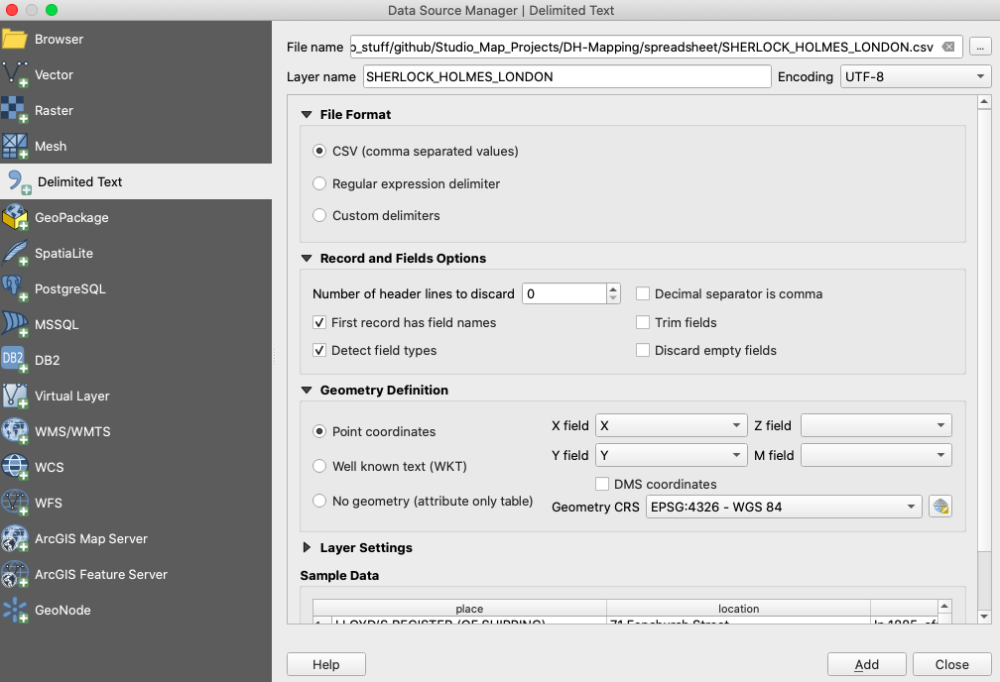  
**Figure 05**. How to fill out the form to add a delimited text layer.

### Step 2: Adding a Base Map
After clicking add, you should see a collection of points on a white background in your map edit window. Not being sure if these points are actually in London, we need a base map for visual verification. You can add one by clicking "XYZ Tiles" in the browser window at the top left corner. Select "OpenStreetMap" and drag and drop this into your map window. Next, in the layers window, make sure to drag the base map under the Sherlock points.

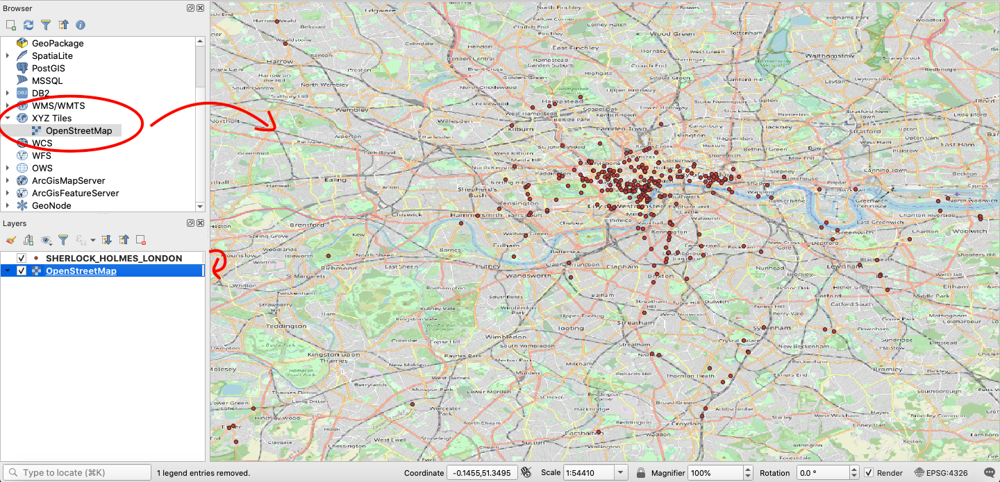  
**Figure 06**. Add a base map and place it beneath the points.

### Step 3: Changing Projections
Things look good, but if you look at maps for a living, this map looks a little squished. This illustrates the importance of projections. Every map is an abstraction of the Earth's natural curvature to a flat surface, so some projections are better than others for particular locations. In this case, it would be good to use a projection developed specifically for London, such as EPSG:102400 (London Survey Grid). In the bottom right corner of your window, you should see a little button that looks like a globe wearing a hat, followed by an EPSG code. This is where you can change your projection. Click on this and, in the form that opens, type "102400" into the "Filter" box. You should now see "London_Survey_Grid" appear in the box beneath "Predefined Coordinate Reference Systems." Click it and then click "OK." After you change the projection, your map should be a little easier on the eyes.

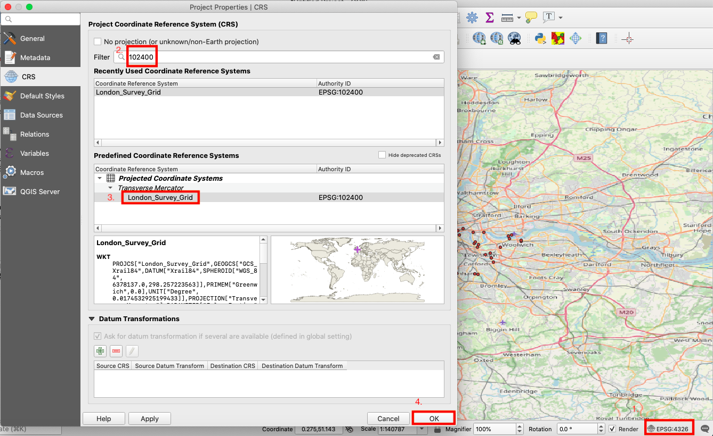  
**Figure 07**. How to change the projection.

 GIS users are trained to think of mappable data in two main categories - vector and raster. Vector data consist of distinct points, lines, and polygons. The spreadsheet data that you have mapped is one example of vector data. In contrast, raster data consist of continuous pixels. A scanned map is an example of raster data. We are now going to add some new raster data to our map.

### Step 4: Adding a Georeferenced Historic Base Map
Adding an historic base map to your project is a nice way to give your map historical context. Using GIS software, you can take any scanned map and "rubber sheet" it to your project in a painstaking process known as georeferencing. Essentially, this is a process of placing a series of pins on your scanned map and linking them to a series of matching pins in your map edit window. After you have done this, you can run a tool in GIS to assign coordinates to each pixel on your scanned map. Luckily, there are several online resources, like the [David Rumsey Map Collection](https://www.davidrumsey.com/), that provide scanned maps that are already georeferenced. I have downloaded and placed one of these maps in the "booth-poverty-map" folder.

Similar to how you added the csv data, click "Layer" in the bar at the top of the screen. Then, click "Add Layer" and "Add Raster Layer." This will open a form.

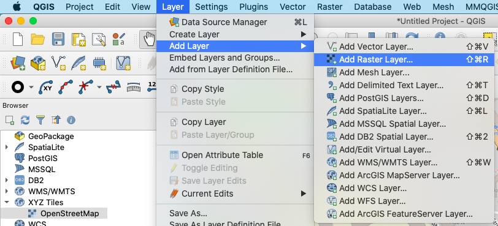  
**Figure 08**. How to add a raster layer.

In the form that opens, navigate to and select the file called "Booth_Descriptive_Map_of_London_Poverty_1889.tif" located in the repository you downloaded. Then, click "Add."

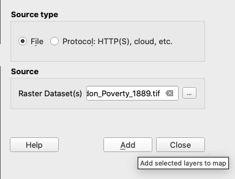  
**Figure 09**. The form for adding a raster layer.

After adding the georefenced raster, you should see Booth's 1889 map of London poverty in your map edit window. Again, make sure to drag this map beneath the points in the layers window. The result should look something like this:

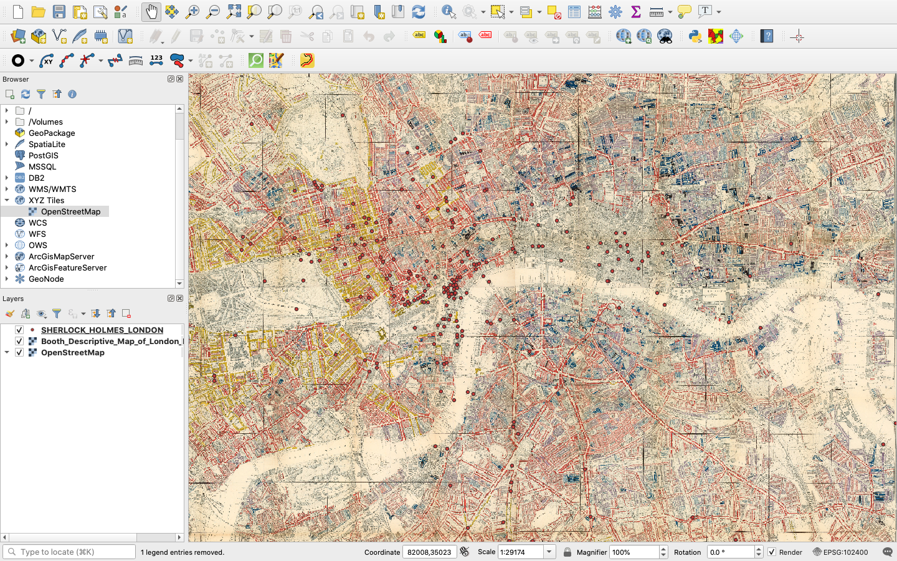  
**Figure 10**. The Booth map in QGIS.

### Step 5: How to Label Points and Change Symbology
Looking at the map in progress, you will see a bunch of points over an old map of London. It is kind of neat to zoom in and out on this map, but the points don't really mean anything without some legible data attached to them. We should probably add some labels to these undifferentiated points.

First, right click over the points layer in the table of contents and select "Properties."

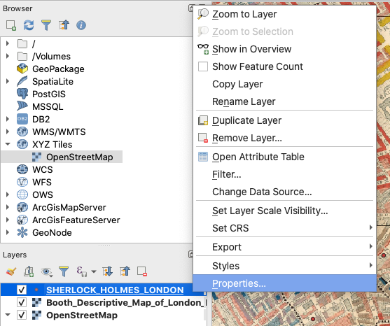  
**Figure 11**. Editing layer properties.

Then, select "Labels" and, in the form that opens, make sure that you select "Single labels", use "place" for "Value," "Bodoni 72 Oldstyle" for "Font," "Bold" for "Style," "12" for "Size," and click "OK." The form should be filled as follows:

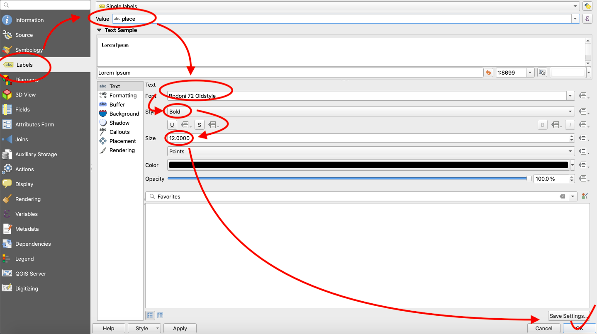  
**Figure 12**. Label form options.

Now that you have labeled the points, let's edit the appearance of the points. Go back the properties options for the layer and, instead of "Labels," choose "Symbology." Fill out the form as follows, choosing "diamond red" and clicking "OK."

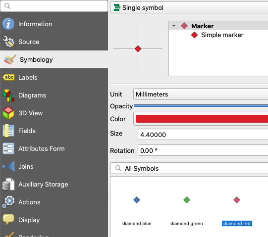  
**Figure 13**. How to change symbology.

After returning to the map, behold the clutter! This is one of the drawbacks of static mapping with this type of data. There is just way too much on the map and no good way to filter it. This being said, we are going to extract points for a single story for a more legible map. "The Adventure of the Noble Bachelor" sounds exciting enough, so let's select that.

### Step 6: Creating a New Layer from a Selection
Again, right click on the points layer in the table of contents and choose "Open Attribute Table." At the top of the attribute table, click the button for the "Select features using an expression" tool. In the expression box, type "story" = 'The Adventure of the Noble Bachelor' and click "Select Features" in the bottom right corner.

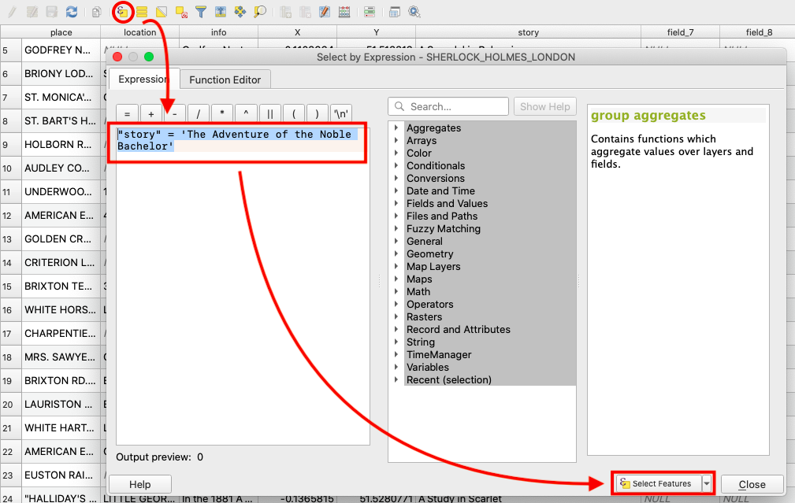  
**Figure 14**. Selecting features by an expression.

After closing the attribute table and returning to the map edit window, you should see a few points highlighted in yellow. You can save these selected points as a new layer by right clicking the points layer once again, choosing "Export," and by clicking "Save Selected Features As."

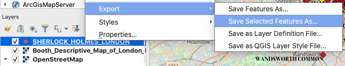  
**Figure 15**. Saving selected features.

In the form that follows, set the format to "GeoJSON" and call the file "noble_bachelor_points.geojson" (making sure you have no spaces in your file names is necessary for successful coding) and save this in the root of the repository that you saved to your desktop. Next, set the CRS to "EPSG:4326 - WGS 84" and set your coordinate precision to 5 decimal points. Make sure that you check the box next to "Add saved file to map" and click "OK."

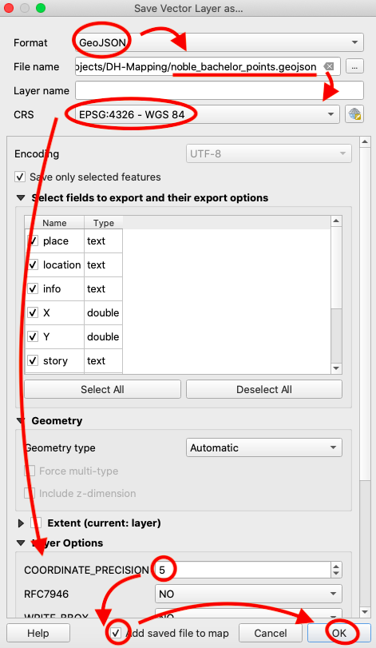  
**Figure 16**. Filling out the export features form.

Now, uncheck the original points layer in your table of contents so that you only see the Noble Bachelor points in your map edit window and zoom into these points. Again, using the methods outlined above, change the properties of this layer so that the points appear as diamonds and feature single labels. As a challenge, try making these diamond markers green. Also, in addition to making the labels Bold 12 pt Bodoni 72 Oldstyle, add a 1 mm white buffer around the text to make it more visible on the map. The result should look like this:

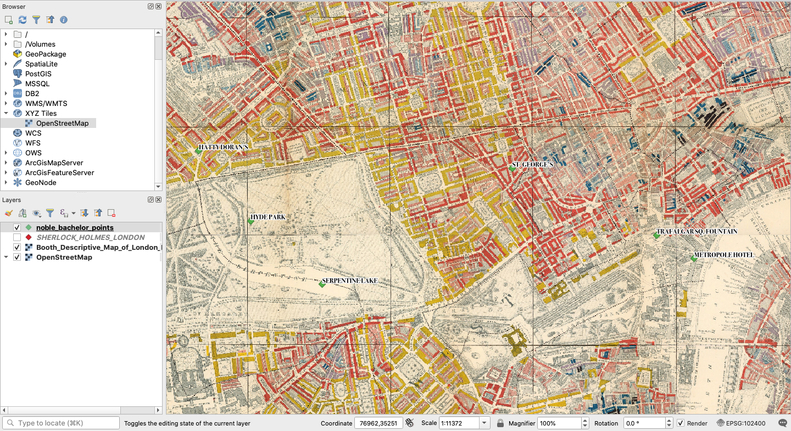  
**Figure 17**. The Noble Bachelor points in a map edit session.

### Step 7: How to Make a Static Map
Now we are ready to make the map. In the edit window, make sure you are zoomed in on the Noble Bachelor points and that all labels are legible. Now, from the options in the bar at the top, choose "Project" and "New Print Layout" or simple hold the command key and press "P" to open a print layout session. A box will appear prompting you to add a print layout title. Let's call this "Noble_Bachelor_Map."

In the print layout screen that opens, you will want to click the button on the lefthand bar that "adds a new label to the layout." This will allow you to add a title to the map.

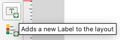  
**Figure 18**. The add new label button.

Next, drag your cursor to make a box for the title across the top. In the item properties box to the right, type "Points of Interest from The Adventure of the Noble Bachelor" in the box, replacing the placeholder text. Then, change the font size to 25 pt and make sure your title box is big enough to display the full title.

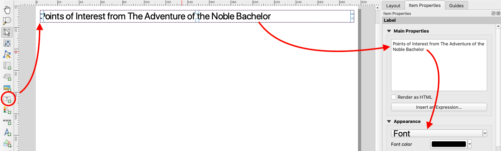  
**Figure 19**. Adding a title.

Next, you will need to click the "adds a new map to the layout button" as shown below.

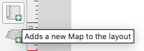  
**Figure 20**. The adds a new map to the layout button.

Just as you did with the title, drag the cursor across the page to add the map. You can move and resize this after you add it. The result should look something like this:

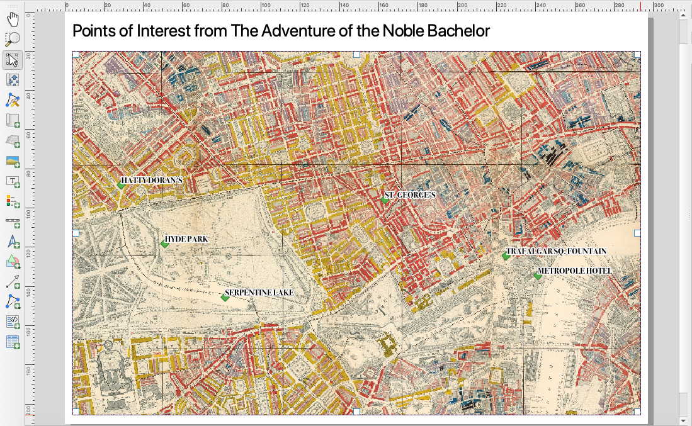  
**Figure 21**. The map added to the print layout.

Using a similar process, see if you can add and style a north arrow in the bottom right corner and a scale bar in the bottom left corner so that your map looks like this:

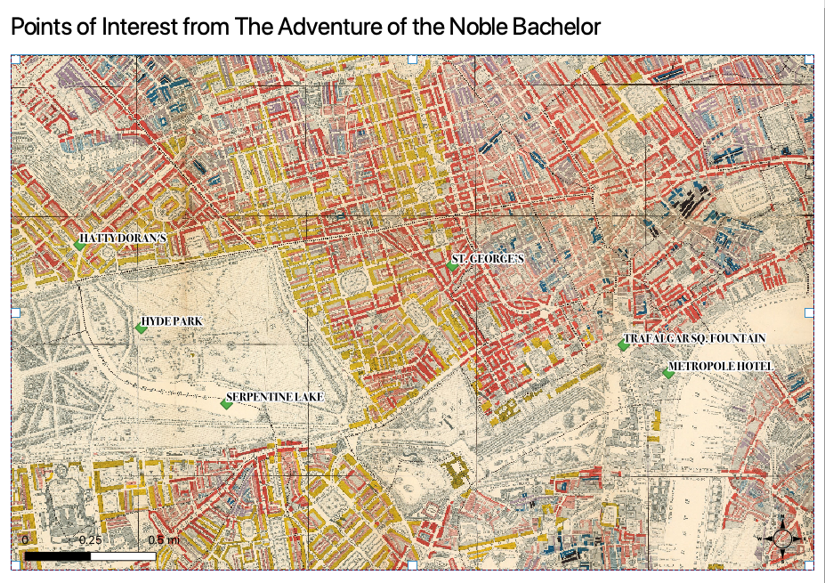  
**Figure 22**. The finished map layout.

Now, your map is ready to export to a printable pdf. At the top of the layout edit window, you will find a button called "Export as PDF." Click this and save your map inside your project folder. Congratulations! You have created a printable static map.

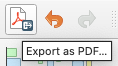  
**Figure 23**. Export a PDF.

## Web Mapping with Leaflet JavaScript

### Step 1: Export a GeoJSON File for Web Mapping
The results are okay, but in the 21st Century, we can do better. Let's take a look at how web mapping with our point data can expand the amount of data we can map and deliver the map user a better and more rewarding interactive experience. The first thing we need to do is to export a new GeoJSON file with all of our Sherlock points.

Return to the map edit window and right click the layer with all of the points (not just the Noble Bachelor points) and click "Export" and "Save Features As." Again, make sure you export in GeoJSON format. Click the three dots next to "File name," save as "sherlock_points," and make sure to save the file inside the "data" folder within the "leaflet-map" folder inside the repository that you downloaded to your desktop. Finally, set coordinate precision to 5 decimal points. You could go with the default 15, but that level of coordinate precision is generally unnecessary and simply makes for heavier files.

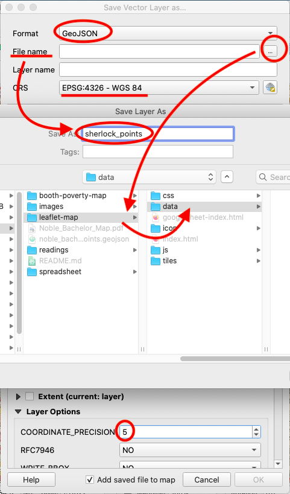  
**Figure 24**. Export all of the Sherlock points.
